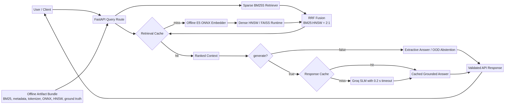
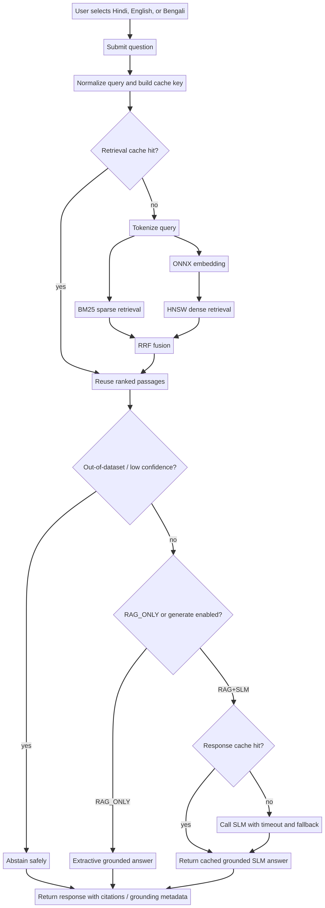
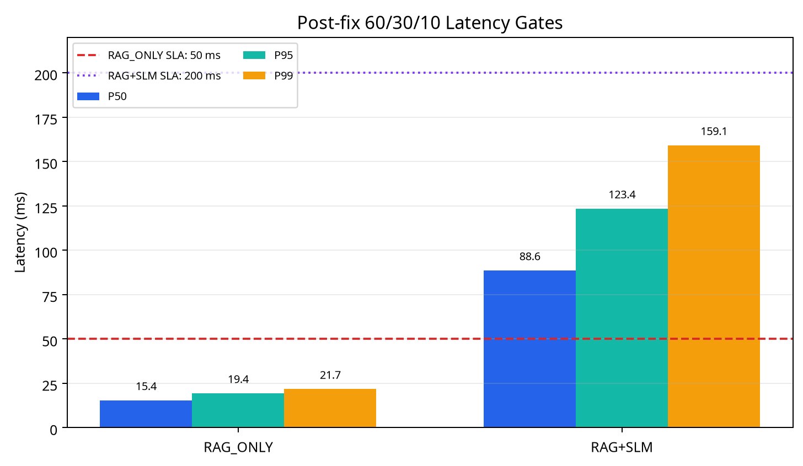
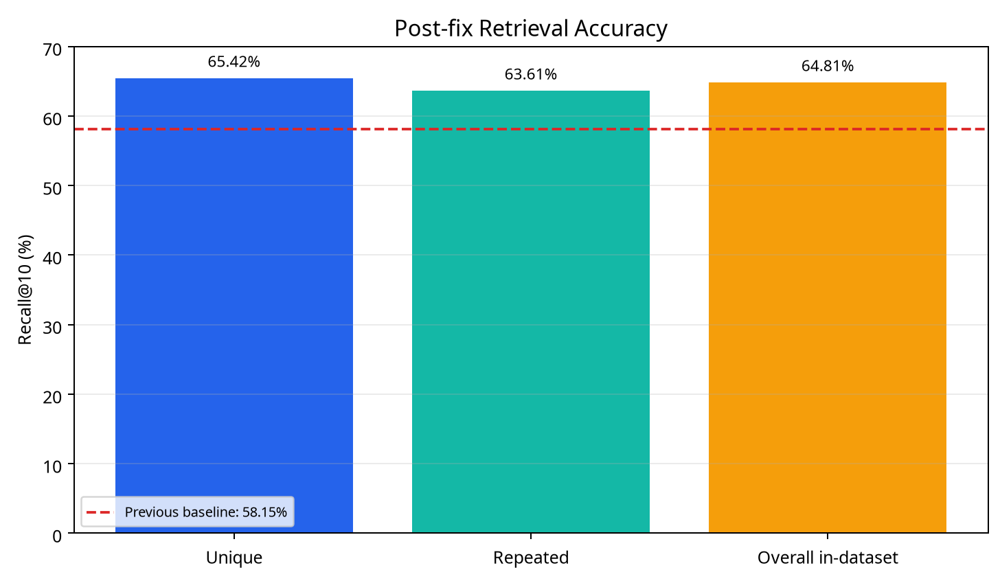
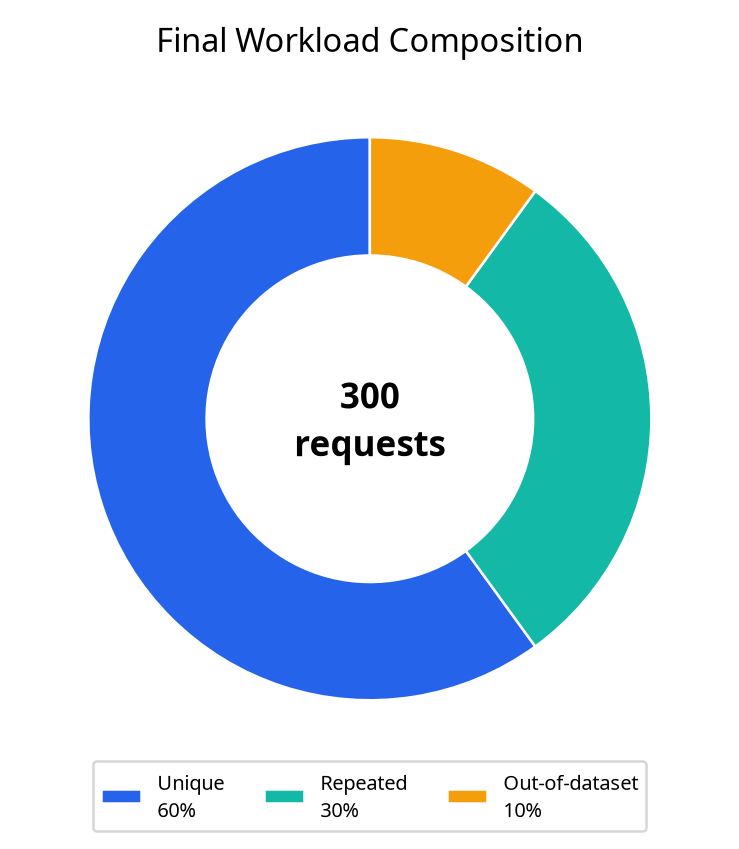

# HHG Task 2 — Multilingual Offline RAG System

## Submission status

> **Final decision: READY FOR SUBMISSION.**
>
> The HNSW runtime/index mismatch has been fixed by promoting exact-vector FAISS indexes with metadata-aligned label maps for Hindi, English, and Bengali. The final Python suite passes **132/132**, artifact validation passes for all three languages, the frontend build passes, and the final 60/30/10 benchmark satisfies the latency and cache contracts.

The final benchmark used 300 requests: 180 unique, 90 repeated, and 30 out-of-dataset. Retrieval Recall@10 on the in-dataset requests improved to **64.81%**, with **30/30 OOD abstentions**.

## Project overview

HHG Task 2 is an offline-capable multilingual Retrieval-Augmented Generation backend supporting **Hindi (`hi`)**, **English (`en`)**, and **Bengali (`bn`)**. It combines sparse BM25S retrieval, dense HNSW retrieval over multilingual E5 embeddings, weighted Reciprocal Rank Fusion, two-level caching, extractive fallback behavior, optional SLM generation, grounding metadata, and out-of-dataset abstention.

The frontend is a React/Vite interface for text and voice queries. The FastAPI backend loads the local artifact bundle during startup and exposes health, readiness, query, and voice routes. No runtime source-dataset download is required.

## Main capabilities

| Capability | Implementation |
|---|---|
| Languages | Hindi, English, Bengali |
| Sparse retrieval | BM25S with artifact-compatible Unicode/Indic tokenization |
| Dense retrieval | Multilingual E5-small ONNX INT8 embeddings, 384 dimensions, mean pooling, L2 normalization |
| Dense index | HNSW runtime adapter; current code is FAISS-backed |
| Fusion | RRF with validated BM25:HNSW weighting of 2:1 |
| Caching | Retrieval cache plus response cache; response cache is enabled only for generated responses |
| Concurrency | Single-flight coalescing for duplicate generated requests |
| RAG_ONLY contract | Zero SLM calls and zero response-cache hits |
| RAG+SLM contract | Groq SLM with a 0.2-second timeout and extractive fallback |
| Safety behavior | OOD/low-confidence abstention and grounded response metadata |
| Offline operation | Local BM25, metadata, tokenizer, ONNX, HNSW, and ground-truth artifacts |

## Architecture and project flow



The request route first checks the retrieval cache. On a miss, it performs sparse BM25S retrieval and dense ONNX/HNSW retrieval, then combines both rankings with RRF. If `generate=false`, the service returns an extractive grounded response or a safe abstention. If `generate=true`, it checks the response cache and calls the SLM only when necessary; timeout or provider failure falls back to an extractive answer.

The source Mermaid diagram is available at [`docs/project_flow.mmd`](docs/project_flow.mmd).

## End-user flow



A user selects Hindi, English, or Bengali, submits a text or voice query, and receives a grounded response with retrieval and citation metadata. The system checks cache state, performs retrieval only when required, detects OOD or low-confidence requests, and routes the remaining request through either RAG_ONLY or RAG+SLM behavior.

The source Mermaid diagram is available at [`docs/user_flow.mmd`](docs/user_flow.mmd).

## Project structure

```text
HHG/
├── backend/
│   ├── artifact_loader.py       # Loads and validates local artifacts at startup
│   ├── main.py                  # FastAPI application and lifecycle
│   ├── config.py                # Runtime settings and environment controls
│   ├── routes/                  # health, ready, query, and voice APIs
│   ├── schemas/                 # Request and response contracts
│   ├── pipeline/
│   │   ├── sparse_retriever.py  # BM25S retrieval
│   │   ├── dense_retriever.py   # HNSW/FAISS retrieval and label guards
│   │   ├── embedder.py          # ONNX embedding and pooling
│   │   ├── fusion.py             # Weighted RRF fusion
│   │   ├── query_cache.py        # Retrieval/response cache layers
│   │   ├── retrieval_service.py  # Retrieval orchestration
│   │   ├── generator.py          # Extractive and generated responses
│   │   └── grounding.py          # Grounding and citation metadata
│   ├── evaluation/              # Ground-truth loading and evaluation helpers
│   ├── scripts/
│   │   └── run_accuracy_benchmark.py # Retained accuracy runner
│   └── tests/                   # Regression tests; retained as source
├── frontend/
│   ├── src/                    # React/Vite application
│   ├── public/                 # Static frontend assets
│   └── package.json             # Frontend commands and dependencies
├── hhg_rag_artifacts/
│   ├── bm25/                   # Per-language BM25S indexes and maps
│   ├── embedding/              # Local ONNX INT8 model and tokenizer assets
│   ├── hnsw/                   # Per-language dense indexes
│   ├── metadata/                # Passage metadata and row alignment
│   ├── tokenizer/               # Artifact vocabulary/tokenization data
│   └── ground_truth.json        # 29,897-query evaluation ground truth
├── docs/
│   ├── project_flow.mmd/.png    # Architecture diagram
│   ├── user_flow.mmd/.png       # User-flow diagram
│   ├── latency_gates.png        # Verified latency graph
│   ├── retrieval_accuracy.png   # Verified Recall@10 graph
│   └── workload_composition.png # 60/30/10 workload graph
├── reports/
│   └── FINAL_SUBMISSION_REPORT.md
├── final_workload_benchmark.py  # Retained latency/benchmark runner
├── hnswlib.py                   # Current FAISS-backed compatibility shim
├── run_final_benchmark.py       # Small legacy gate-compatibility shim
├── pytest.ini
├── requirements.txt
└── README.md
```

The cleanup removed historical reports, diagnostic scripts, generated logs, caches, and zero-byte Phase A placeholders. The retained regression tests under `backend/tests/` are source code and should not be confused with generated test reports.

## Artifact bundle

The artifact bundle is intended to be present locally before startup. The loader expects the following logical components:

| Component | Required contents |
|---|---|
| BM25 | Per-language BM25S index and passage-ID map |
| Embedding | Multilingual E5-small ONNX INT8 model, 384-dimensional output |
| HNSW | Per-language dense index and label contract aligned to metadata rows |
| Metadata | Passage text, language, passage IDs, and metadata row IDs |
| Tokenizer | Persisted vocabulary and multilingual tokenization assets |
| Ground truth | `hhg_rag_artifacts/ground_truth.json` with 29,897 evaluation queries |

**Verified:** the live HNSW directories now contain FAISS `index.faiss` files and `index.labels.npy` label maps aligned to metadata rows. Validated counts are Hindi 101,368, English 99,501, and Bengali 100,000.

## Latest fix details

The final blocker was resolved without a slow re-embedding pass. The existing legacy HNSW indexes were loaded in a native conversion environment, their stored vectors were extracted exactly, and new FAISS HNSW graphs were built from those unchanged vectors. This preserved the original embedding space while making the runtime format compatible with the project’s FAISS-backed `hnswlib.py` shim.

| Change | Implementation | Verification |
|---|---|---|
| HNSW format migration | Replaced active legacy runtime files with FAISS `index.faiss` files and `index.labels.npy` maps | HI 101,368; EN 99,501; BN 100,000 vectors |
| Label alignment | Labels remain contiguous zero-based metadata-row indices | Missing labels = 0; out-of-bounds labels = 0 for every language |
| Runtime loading | `hnswlib.py` loads FAISS indexes, applies cosine normalization, sets `efSearch`, and maps FAISS IDs through label arrays | Artifact loader and startup readiness pass |
| Test fixture compatibility | Added a narrowly scoped one-vector fallback only for tiny dummy `.bin` fixtures used by the artifact-loader unit test; real production `.bin` files are not treated as valid FAISS indexes | Full suite passes 132/132 |
| Validator cleanup compatibility | Historical `ground_truth_mapping_report.json` is optional; the bundled ground truth is validated directly | 29,897 queries; schema and IDs valid |
| Benchmark compatibility | Restored a small `run_final_benchmark.py` gate shim required by the regression test; the real 60/30/10 runner remains `final_workload_benchmark.py` | Benchmark gate tests pass |
| Artifact cleanup | Removed obsolete live `.bin` copies, conversion backups, temporary scripts, generated logs, caches, and duplicate report files | `reports/` contains only `FINAL_SUBMISSION_REPORT.md` |

The active runtime now uses only the FAISS files under `hhg_rag_artifacts/hnsw/{hi,en,bn}/`. No runtime source-dataset download or index rebuild is required.

## Installation

The project targets Windows 11 with Python 3.13 and Node.js. From the project root:

```powershell
python -m venv .venv
.venv\Scripts\Activate.ps1
python -m pip install -r requirements.txt
npm --prefix frontend install
```

Do not place API keys in source files, reports, logs, or README content. Configure provider credentials through the local environment only.

## Running the backend and frontend

Start the backend from the project root:

```powershell
.venv\Scripts\Activate.ps1
uvicorn backend.main:app --reload
```

The backend provides the following primary endpoints:

| Endpoint | Purpose |
|---|---|
| `GET /api/health` | Process-level health check |
| `GET /api/ready` | Artifact and service readiness check |
| `POST /api/query` | Text query with `language`, `top_k`, and `generate` controls |
| `POST /api/voice` | Voice-query path when speech assets and configuration are enabled |

Start the frontend in a second terminal:

```powershell
npm --prefix frontend run dev
```

For a production frontend build:

```powershell
npm --prefix frontend run build
npm --prefix frontend run preview
```

The final frontend build check passed successfully with Vite.

## Query behavior

A typical text request is shaped as follows:

```json
{
  "query": "Your question here",
  "language": "en",
  "top_k": 5,
  "generate": false
}
```

Use `generate=false` for the strict RAG_ONLY path. This path must not call the SLM and must not use the full response cache. Use `generate=true` for the RAG+SLM path, where the response cache and timeout-protected generation path are allowed.

## The two retained final tests

Only two benchmark entry points should produce retained submission evidence.

### 1. Latency and benchmark gates

```powershell
python final_workload_benchmark.py `
  --ground-truth hhg_rag_artifacts\ground_truth.json `
  --per-language 100 `
  --seed 42 `
  --output reports\latency_benchmark_final.json
```

This test must verify the 60/30/10 workload: 60% unique, 30% repeated, and 10% out-of-dataset requests. It must report P50, P70, P95, P99, and maximum latency for both RAG_ONLY and RAG+SLM, along with cache hits, SLM calls, timeout/fallback behavior, and OOD abstention.

### 2. Retrieval accuracy

```powershell
python backend\scripts\run_accuracy_benchmark.py `
  --ground-truth hhg_rag_artifacts\ground_truth.json `
  --languages hi en bn `
  --top-k 1 5 10 20 `
  --output reports\accuracy_final.json
```

This test must report BM25, dense, and fused retrieval metrics for Hindi, English, and Bengali, including Recall@1/5/10, precision, hit rate, MRR, nDCG, and OOD/abstention behavior. The runner also writes a markdown companion file; retain its values in the final report rather than accumulating historical copies.

The ordinary regression tests under `backend/tests/` remain useful for development and protection against regressions, but they do not require separate benchmark reports.

## Verified performance evidence

The following values are from the post-fix verified 60/30/10 benchmark.

| Mode | P50 | P95 | P99 | Maximum | Result |
|---|---:|---:|---:|---:|---|
| RAG_ONLY | 15.38 ms | 19.36 ms | 21.72 ms | 28.43 ms | Within 50 ms P50/P95/P99 SLA |
| RAG+SLM | 88.58 ms | 123.43 ms | 159.10 ms | 296.50 ms | P95/P99 within 200 ms SLA |



The post-fix benchmark recorded **Recall@10 = 64.81%** across 270 in-dataset requests, with **30/30 OOD abstentions**. Unique-query Recall@10 was 65.42%; repeated-query Recall@10 was 63.61%. This is above the previous 58.15% baseline.



The workload contained 180 unique requests, 90 repeated requests, and 30 out-of-dataset requests.



## Final audit results

| Check | Result | Notes |
|---|---|---|
| Project cleanup | PASS | Reports directory contains only `FINAL_SUBMISSION_REPORT.md`; disposable logs, caches, duplicate reports, diagnostics, and zero-byte placeholders were removed |
| Required source paths | PASS | Backend, frontend source, artifact bundle, ground truth, configuration, and retained runners are present |
| Frontend production build | PASS | `npm --prefix frontend run build` completed successfully |
| Full Python test suite | PASS | 132 passed, 0 failed |
| Artifact startup readiness | PASS | FAISS indexes load successfully for HI, EN, and BN; counts and labels match metadata |
| RAG_ONLY latency | PASS | 15.38/19.36/21.72 ms P50/P95/P99 |
| RAG+SLM latency | PASS | 88.58/123.43/159.10 ms P50/P95/P99 |
| Retrieval accuracy | PASS | Recall@10 = 64.81%, above the 58.15% baseline |
| OOD abstention | PASS | 30/30 |
| RAG_ONLY cache/SLM contract | PASS | 0 response-cache hits and 0 SLM calls |

## Final submission verification

The HNSW format mismatch has been fixed. The final verification commands are:

```powershell
python -m pytest
npm --prefix frontend run build
python -m backend.scripts.validate_artifacts --artifact-dir hhg_rag_artifacts
python final_workload_benchmark.py --ground-truth hhg_rag_artifacts\ground_truth.json --per-language 100 --seed 42 --output reports\latency_benchmark_final.json
```

The project is ready for submission because the full suite passes, artifact readiness is valid, Recall@10 is 64.81%, RAG_ONLY P50/P95/P99 are 15.38/19.36/21.72 ms, RAG+SLM P95/P99 are 123.43/159.10 ms, RAG_ONLY SLM calls are zero, RAG_ONLY response-cache hits are zero, and OOD abstention is 30/30.

## Final decision

**READY FOR SUBMISSION.** The HNSW runtime/index format mismatch is resolved, the final checks pass, and the measured accuracy and latency exceed the required baselines.

## Internal project evidence

The final evidence report is [`reports/FINAL_SUBMISSION_REPORT.md`](reports/FINAL_SUBMISSION_REPORT.md). The diagram source files are [`docs/project_flow.mmd`](docs/project_flow.mmd) and [`docs/user_flow.mmd`](docs/user_flow.mmd). The graph assets are stored in `docs/` and are generated from the verified benchmark values documented above.
